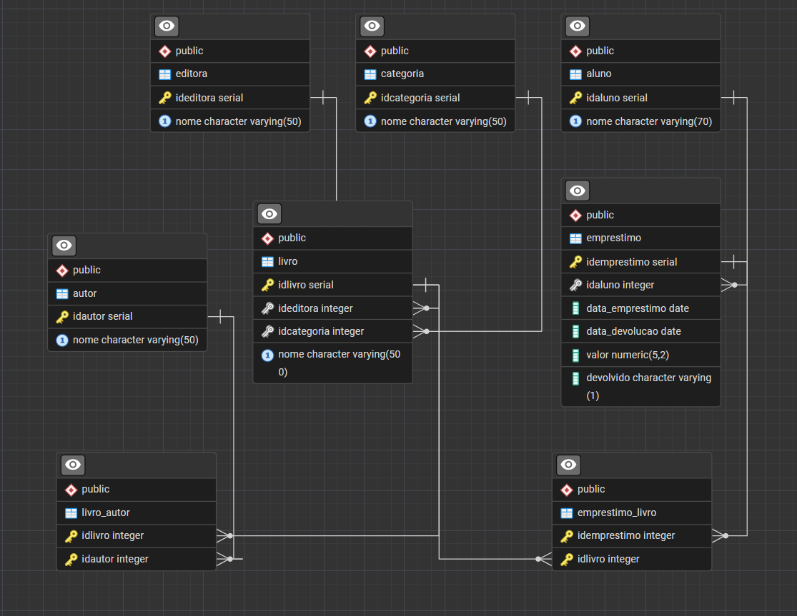

# 📚 Sistema de Gerenciamento de Biblioteca - PostgreSQL

Projeto prático desenvolvido durante um curso de PostgreSQL, seguindo os requisitos propostos pelo instrutor. O objetivo foi aplicar conceitos de modelagem de banco de dados relacional, criação de tabelas, relacionamentos, constraints e consultas SQL em um cenário de gerenciamento de biblioteca.

---

## 🗂️ Modelo Entidade-Relacionamento (ERD)

  

---

## 🚀 Tecnologias Utilizadas

- PostgreSQL
- SQL

---

## 📌 Funcionalidades

- Modelagem de banco de dados relacional
- Criação de tabelas
- Definição de chaves primárias e estrangeiras
- Relacionamentos 1:N e N:N
- Inserção de dados
- Criação de índices
- Criação de Views
- Consultas SQL utilizando JOIN

---

## 🏛️ Estrutura do Banco de Dados

O banco foi desenvolvido para gerenciar uma biblioteca, contemplando as seguintes entidades:

- 📖 Livro
- ✍️ Autor
- 🏢 Editora
- 📚 Categoria
- 👨‍🎓 Aluno
- 📋 Empréstimo

Além das tabelas associativas:

- Livro_Autor
- Emprestimo_Livro

---

## 🎯 Objetivos do Projeto

Durante o desenvolvimento deste projeto foram praticados conceitos como:

- Modelagem Relacional
- Integridade Referencial
- Constraints
- Chaves Primárias e Estrangeiras
- Relacionamentos entre tabelas
- Consultas SQL
- Views
- Índices

---

## 📝 Observação

Este projeto foi desenvolvido como atividade prática durante um curso de PostgreSQL, seguindo a proposta apresentada pelo instrutor. O código foi mantido em sua estrutura original para representar fielmente o aprendizado realizado ao longo do curso.

---

## 👩‍💻 Autora

**Bruna Luiza Ximenes da Silva**

- 💼 LinkedIn: https://www.linkedin.com/in/bruna-silva-310139164/
- 🐙 GitHub: https://github.com/blximenes
